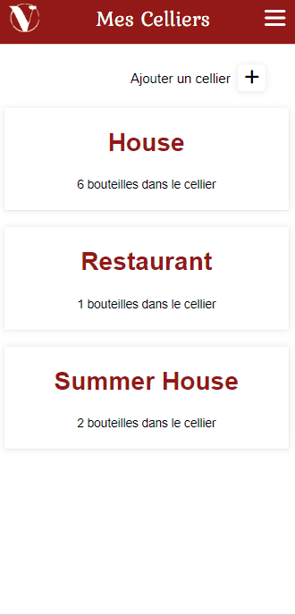

# Vino - Projet Web 2

Démo / Code de départ : https://jmartel.webdev.cmaisonneuve.qc.ca/n61/vino/

## Fonctionnalités
* Inscription, connexion et déconnexion
* Gestion des celliers (Création, modification et suppression d'un cellier)
* Gestion des bouteilles (Ajout, modification des informations et suppression d'une bouteille du cellier dans lequel on se trouve)
* Modifier la quantité des bouteilles dans nos celliers (+ et -)
* Recherche d'une bouteille dans notre catalogue (clone du catalogue de vin de la SAQ) pour l'ajouter à un cellier
* Responsivité pour tablette et mobile

